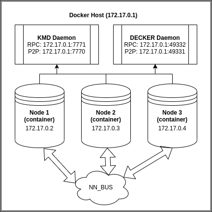

### What's this?

It's automated notarizations testnet environment.

### How it works?

We have a PC with 2 daemons running (KMD, DECKER), for example. Also we have a 3 docker containers with separate iguana / notary node in each. Using iptables rules we fool iguana, forced it to think that it connected to the daemon RPC at 127.0.0.1, but in real all iguanas connected to the same coin daemon installed on docker host. So, it's just a transparent port forwarding of `127.0.0.1:RPC_PORT -> 172.17.0.1:RPC_PORT`. As a result we have just one daemon per coin utilized by as many notaries as we want, that perfectly fits in dev purposes, bcz we don't need as many physical hosts as many notaries we have.



### How to prepare docker environment?

Install docker ([guide](https://www.digitalocean.com/community/tutorials/how-to-install-and-use-docker-on-debian-10)):
```
sudo apt update
sudo apt install apt-transport-https ca-certificates curl gnupg2 software-properties-common
curl -fsSL https://download.docker.com/linux/debian/gpg | sudo apt-key add -
sudo add-apt-repository "deb [arch=amd64] https://download.docker.com/linux/debian $(lsb_release -cs) stable"
sudo apt update
sudo apt-cache policy docker-ce
sudo apt install docker-ce
sudo systemctl status docker
```

Clone `iguana-docker` repo:
```
git clone https://github.com/DeckerSU/iguana-docker
cd iguana-docker
```

Generate `notaries.json` file:
```
prepare-notaries.sh > notaries.json
```
Will be look like:
```
[
  {
    "id": "1",
    "passphrase": "fa2511419ea73899a2be34dbd3f172bd173d4d045d1163d4e370305564ea73ce",
    "address": "RHSKEzvQD9o3xScf7g64WEpRfGox6zpMYM",
    "wif": "UsFnnktnXcvxwGaGsvWfHhD7Ej444YVibyYCJqrRp2jDzWLA2fTo",
    "pubkey": "02bb7ab714d858f5da75f93fdb0ab93822f142054262a4425205bb70efe7225394"
  },
...
```
Parse `notaries.json` and generate other files:
```
parse_notaries.py notaries.json
```
The following files will be generated:

- `docker_test_elected` - elected file for iguana testnet
- `import_privkeys` - file with privkeys in daemon import convenient format
- `m_notary_docker_test` - iguana startup file (will be placed inside a docker container on next step)
- `start_containers` - script with start_containers instructions 

Build docker image:
```
sudo docker build -t iguana-test .
```

### Prepare daemons

By default testnet will be configured with all mainnet assetchains enabled, that means that
RPC requests to any mainnet ACs from inside of the docker container will be forwarded to
decker host, additionally special test assetchain `DECKER` will be configured to dPoW in KMD
by default.

Params of `DECKER` AC is following:
```
-ac_name=DECKER -ac_supply=777777 -ac_reward=100000000
```
Start `komodod` on docker host with the args above and after it create config file in 
`~/.komodo/DECKER/DECKER.conf` - stop it and add following lines;
```
rpcbind=172.17.0.1
rpcallowip=172.17.0.1/16
```
Where `172.17.0.1/16` is the default docker `bridge subnet`. You can get docker subnets via
`sudo docker network ls`, and inspect needed subnet with `sudo docker network inspect bridge`,
where `bridge` here is a subnet name. Also you'll need to change RPC credentials in the
`~/.komodo/DECKER/DECKER.conf` on following:
```
rpcuser=rpcuser
rpcpassword=bitcoin123
```
This is needed bcz iguana in docker container using that credentials by default for ANY (!) deamon,
if other not specified by variables `DEFAULT_RPC_USERNAME` and `DEFAULT_RPC_PASSWORD` by passing 
environment variables to container, during start.

But only only `DECKER` AC is active to dPoW by default. If you want to add any other chains in
`m_notary_docker_test` - feel free to add them, but you'll need to properly set-up `rpcbind`,
`rpcallowip`, `rpcuser` and `rpcpassword` in their `.conf` file. Same applies and to `KMD` 
itself (mean, you must change these variables in `komodo.conf`).

Start `KMD` and `DECKER` assetchains on docker host:

```
~/komodo/src/komodod -ac_name=DECKER -ac_supply=777777 -ac_reward=100000000 &
~/komodo/src/komodod -opretmintxfee=0.004 -minrelaytxfee=0.000035 &
```

Import privkeys to each daemon, using `import_privkeys` file content as a helper.

Send the funds to the notaries addresses.

### Launch containers

Launch containers automatically via:
```
source start_containers
```
Also, if you want you can start one of containers in interactive mode:
```
sudo docker run --name iguana_<X> --privileged --network=bridge -it --rm -e PUBKEY="<PUBKEY>" -e PASSPHRASE="<PASSPHRASE>" iguana-test bash
```
where `X` is notary and `PUBKEY` and `PASSPHRASE` params of selected node from `notaries.json`. In case of start container manually in 
interactive mode to start dPoW use the following:
```
cd $HOME/dPoW/iguana
./m_notary_docker_test
```

Don't forget to attach to the each container and do initial splitfunds:
```
curl -s --url "http://127.0.0.1:7779" --data '{"coin":"KMD","agent":"iguana","method":"splitfunds","satoshis":"10000","sendflag":1,"duplicates":"50"}'
curl -s --url "http://127.0.0.1:7779" --data '{"coin":"DECKER","agent":"iguana","method":"splitfunds","satoshis":"10000","sendflag":1,"duplicates":"50"}'
```
To connect container console use `sudo docker exec -it iguana_X bash`, to quit (de-attach console) from console and leave container working press
`Ctrl-P` followed by `Ctrl-Q` inside docker interactive console.

To watch iguana log from specific container you can use `sudo docker exec -it iguana_3 tail -f /root/dPoW/iguana/iguana.log`.


### F.A.Q.

#### How to check daemon connection from the inside of docker container?

Attach to the needed docker container:
```
sudo docker attach iguana_1
```
Or launch interactive shell in selected container:
```
sudo docker exec -it iguana_1 bash
```
Then, inside a container run:
```
# KMD example
curl --trace-time -v --user rpcuser:bitcoin123 --data-binary '{"jsonrpc": "1.0", "id":"curltest", "method": "getinfo", "params": [] }' -H 'content-type: text/plain;' http://127.0.0.1:7771
# DECKER example
curl --trace-time -v --user rpcuser:bitcoin123 --data-binary '{"jsonrpc": "1.0", "id":"curltest", "method": "getinfo", "params": [] }' -H 'content-type: text/plain;' http://127.0.0.1:49332
```

#### How to check the funds from the inside of docker container?
```
# KMD example
# check that ismine of your address is true
curl --trace-time -v --user rpcuser:bitcoin123 --data-binary '{"jsonrpc": "1.0", "id":"curltest", "method": "validateaddress", "params": ["RHSKEzvQD9o3xScf7g64WEpRfGox6zpMYM"] }' -H 'content-type: text/plain;' http://127.0.0.1:7771 | jq .
# listunspent
curl --trace-time -v --user rpcuser:bitcoin123 --data-binary '{"jsonrpc": "1.0", "id":"curltest", "method": "listunspent", "params": [1, 99999999, ["RHSKEzvQD9o3xScf7g64WEpRfGox6zpMYM"]] }' -H 'content-type: text/plain;' http://127.0.0.1:7771 | jq .
```


#### How to stop all runned docker containers?

It's simple:
```
sudo docker stop $(sudo docker ps -q -a)
```

#### How to remove all stopped docker containers?

```
sudo docker rm $(sudo docker ps -q -a)
```

#### How to list all docker containers?

```
sudo docker ps -a
```


